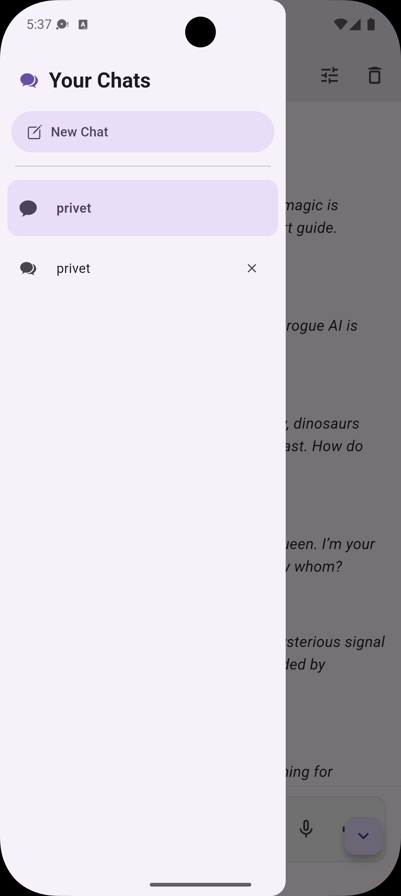

# ai_chat_bot

AI Chat Bot is a sophisticated conversational interface built with Flutter, powered by OpenRouter to provide access to a wide range of advanced AI models. This project features a seamless chat experience with local persistence and context-aware responses.

## Features

- **Real-time Interaction**: Instant messaging capabilities with AI models.
- **OpenRouter Integration**: Access multiple LLMs (like GPT-4, Claude, Llama 3) through a single API provider.
- **Local Storage**: Uses `sqflite` to save chat history and sessions locally on the device.
- **Context Awareness**: Maintains conversation history for more accurate and relevant AI responses.
- **Clean UI**: A modern, responsive interface built with Flutter.

## Tech Stack

- **Framework**: Flutter (Dart)
- **AI Engine**: OpenRouter API
- **Database**: sqflite (Local SQLite storage)

## Getting Started

### Prerequisites

- Flutter SDK (Latest Version)
- Android Studio
- An API Key from [OpenRouter](https://openrouter.ai/)

### Installation

1. Clone the repository:

   ```bash
   git clone https://github.com/yourusername/ai_chat_bot.git
   cd ai_chat_bot
   ```

2. Install dependencies:

   ```bash
   flutter pub get
   ```

3. Configure your API Key:
   Open the `lib/screens/home_screen.dart` file and locate the API key variable. Replace the placeholder with your actual OpenRouter API key:
   ```dart
   final String _apiKey = 'your_api_key_here';
   ```

### Running the Application

1. Connect your device or start an emulator.
2. Run the app:
   ```bash
   flutter run
   ```

## Screenshots

|                Chat Interface                |               Conversation History                |
| :------------------------------------------: | :-----------------------------------------------: |
|  |  |

## Usage

Once the app is launched, you can start a new conversation. The app will automatically save your messages to the local database using `sqflite`, allowing you to resume chats even after restarting the app.

## Contributing

Contributions are welcome! Please fork the repository and submit a pull request.

## License

This project is licensed under the MIT License.
